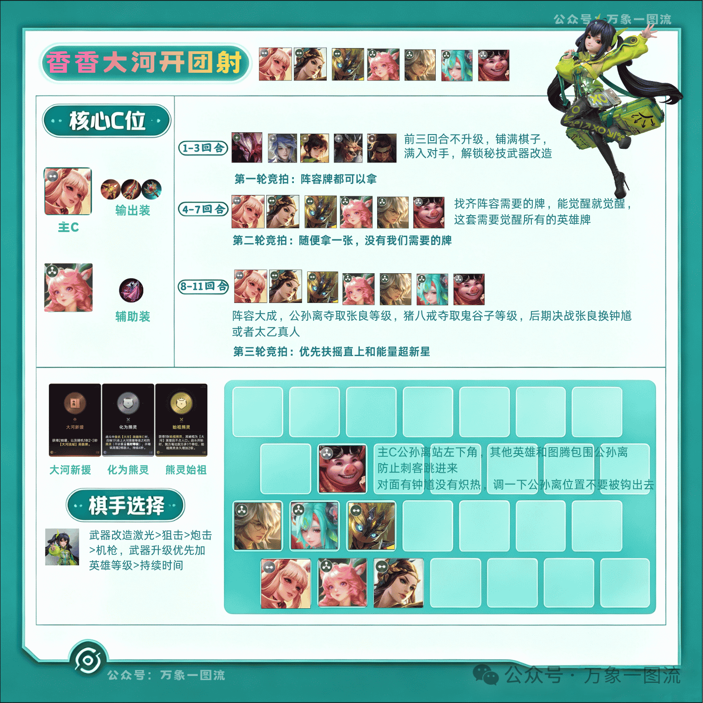

# 香香大河开团射

## 阵容核心

这套阵容的绝对输出点不是棋子，而是棋手「香香」。阵容里的英雄牌只负责一件事——用连胜压制对手、满入血线，让香香的秘技「枪炮艺术」快速累计对棋手造成的伤害，从而触发秘技牌「武器改造」。武器改造叠满之后，香香的输出再反哺棋子等级，形成「连胜 → 强化香香 → 香香养棋子」的正循环。

> ⚠️ 注意：这套阵容 **Ban 掉大河** 时不能玩。

## 阵容组成

| 阶位 | 英雄 |
|------|------|
| 2 阶 | 公孙离（无阵营）、虞姬（大河）、鬼谷子（大河） |
| 3 阶 | 瑶（大河）、张良（大河）、少司缘（大河）、猪八戒（无阵营） |

> 看到有人玩养猪流，可以把猪八戒换成云中君，差距不大；后期决战时张良可换成钟馗或太乙（钟馗 ＞ 太乙）。

## 阵容思路

- 核心输出是棋手香香，棋子只是辅助，要尽可能用阵容打出连胜来强化香香的输出。
- 香香的秘技「枪炮艺术」会累计对棋手造成的伤害，累计到一定程度触发秘技牌「武器改造」，尽量在 12 回合前把 4 次武器改造全部吃满。
- 第三次竞拍优先拿「扶摇直上」和「能量超新星」；升到 6 级解锁专属技能「火力全开」，进一步强化香香的输出。
- 3 级开始搜牌，找齐阵容所需的英雄。这套阵容要觉醒所有英雄牌，都是 2 阶、3 阶卡，觉醒难度不高。

## 运营细节

1. **前三回合不升级**：铺满棋子，优先拿干将、牛头、孙尚香等，尽可能满入对手，尽快触发香香秘技。
2. **武器改造优先级**：首选「激光模式」，其次「狙击模式」。
3. **后续改造优先加棋子等级**，其次加持续时间。
4. **公孙离的等级来源**：公孙离不要夺取瑶的等级——瑶 100 级时能给公孙离提供大量属性；猪八戒则夺取鬼谷子的等级。
5. **公孙离尽量夺取张良等级**：每次打出公孙离，就把公孙离和张良单独拿出来放一起，打完后再把公孙离放回左下角。
6. **瑶做一件破茧之衣**：可以分给三个英雄，眩晕对面三次。
7. **决战换牌**：决战回合把功能牌张良换成钟馗或太乙，钟馗 ＞ 太乙。

## 天赋选择

熊灵类天赋必拿。

## 装备推荐

- **公孙离**：日渊、无尽巨剑、炽热支配。
- **瑶**：破茧之衣。
- **猪八戒**：肉装。

## 总结

「香香大河开团射」是一套前期疯狂压制的运营阵容：前三回合不升级铺满棋子，靠满入对手快速叠满香香的「武器改造」，再借武器改造强化棋子等级、反哺输出。这套阵容前期必须保持连胜，一旦断连胜就会越来越疲软——玩香香的目标就是「保二争一」，趁对手的「三分倒转」「海陆空」还没大成之前，把血线压到残血，抢先终结比赛。
